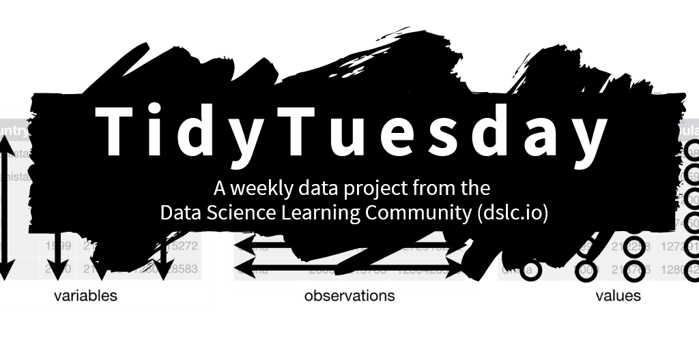

 

## About TidyTuesday

- `TidyTuesday` is a weekly social data project. All are welcome to participate! Please remember to share the code used to generate your results!
- `TidyTuesday` is organized by the [Data Science Learning Community](https://dslc.io). [Join our Slack](https://dslc.io/join) for free online help with R, Python, and other data-related topics, or to participate in a data-related book club!

## Goals

Our over-arching goal for TidyTuesday is to provide real-world datasets so that people can learn to work with data.

- [x] For 2024, our goal was to be used in at least 10 courses. Our survey indicates that we are used in at least 30 courses!
- [ ] For 2025, our goal is to crowdsource the curation of TidyTuesday datasets.
  
 

> 🔗 *This is an adaptation of the original repository:  [TidyTuesday Repository](https://github.com/rfordatascience/tidytuesday/blob/main/README.md?plain=1).*
        